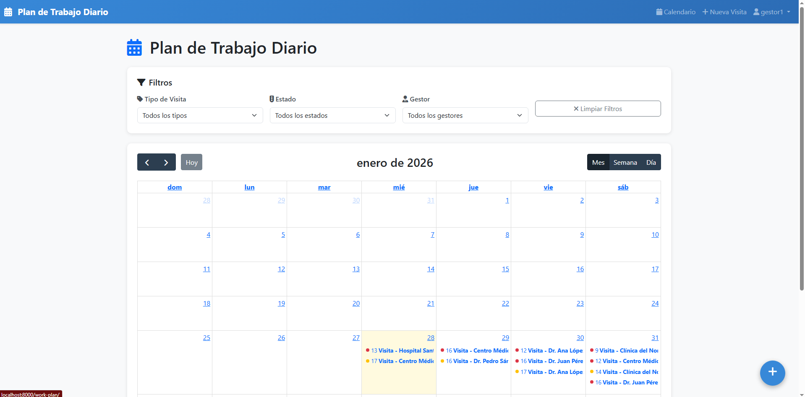
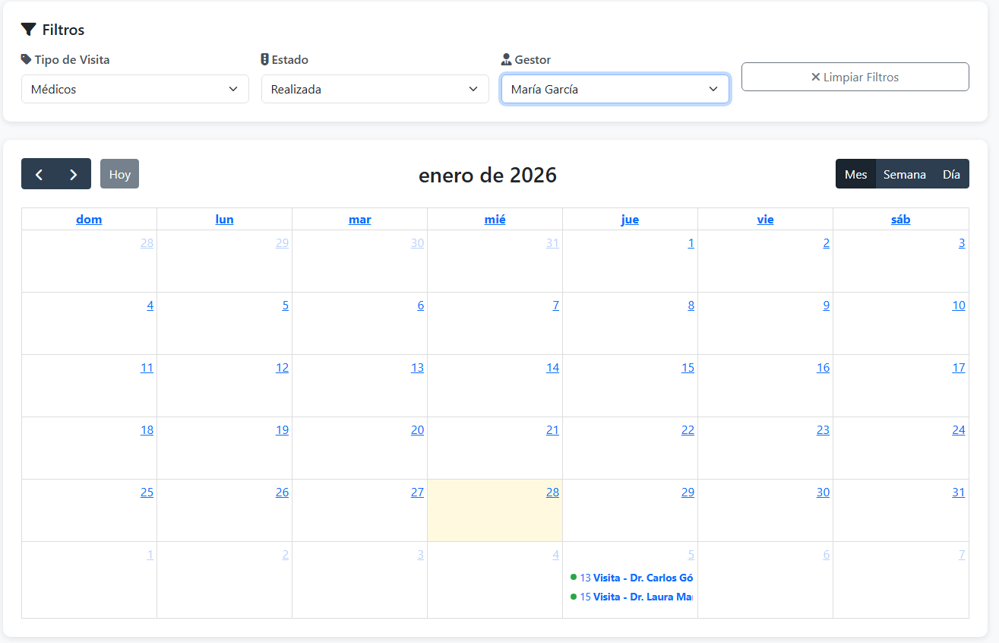
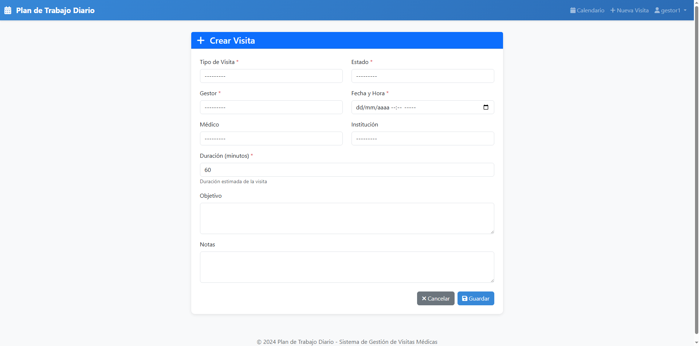
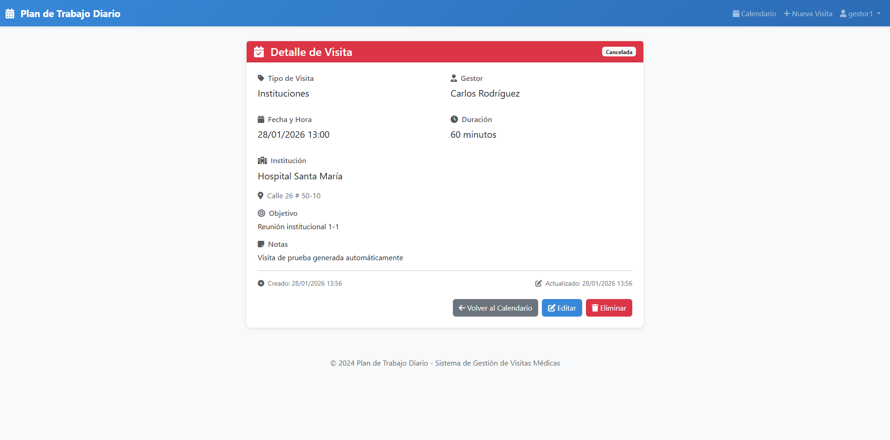
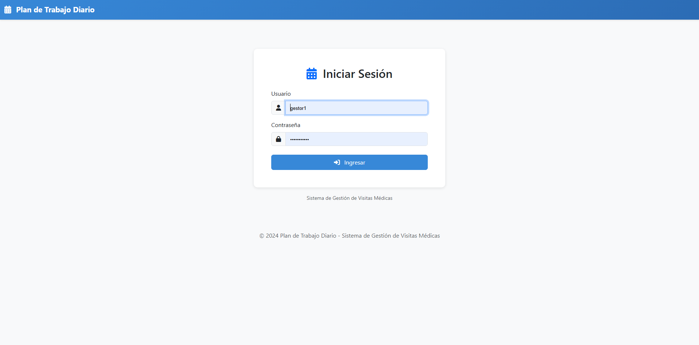

# Plan de Trabajo Diario - Sistema de Gestión de Visitas Médicas

Sistema web desarrollado en Django para la gestión y visualización de visitas médicas e institucionales en formato de calendario interactivo.


## 📋 Características Principales

- **Calendario Interactivo**: Vista mensual, semanal y diaria con FullCalendar.js
- **Gestión Completa de Visitas**: CRUD completo (Crear, Leer, Actualizar, Eliminar)
- **Filtros en Tiempo Real**: Por tipo de visita, estado y gestor
- **API REST**: Endpoint para consumo de eventos
- **Código de Colores**: Estados visuales según programación
- **Responsive Design**: Compatible con diferentes dispositivos
- **Autenticación**: Sistema de login/logout integrado

## 🎨 Colores por Estado

| Estado | Color | Código Hex |
|--------|-------|------------|
| Programada | Azul | #3788d8 |
| Realizada | Verde | #28a745 |
| Reprogramada | Naranja | #ffc107 |
| Cancelada | Rojo | #dc3545 |

## 🛠️ Tecnologías Utilizadas

### Backend
- **Django 4.2**: Framework web
- **PostgreSQL**: Base de datos relacional
- **Django ORM**: Mapeo objeto-relacional
- **Django REST Framework**: API REST (implícito en las vistas)

### Frontend
- **Django Templates**: Motor de plantillas
- **Bootstrap 5**: Framework CSS
- **FullCalendar.js 6**: Librería de calendario
- **Font Awesome**: Iconografía
- **Vanilla JavaScript**: Interactividad

## 📦 Requisitos Previos

- Python 3.11 o superior
- PostgreSQL 15 o superior
- pip (gestor de paquetes de Python)
- virtualenv (recomendado)

## 🚀 Instalación

### 1. Clonar el Repositorio

```bash
git clone https://github.com/diegonzalez36/PruebaTecnicaMedassistcorp.git
cd work-plan-app
```

### 2. Crear Entorno Virtual

```bash
# Crear entorno virtual
python -m venv venv

# Activar entorno virtual
# En Windows:
venv\Scripts\activate
# En Mac/Linux:
source venv/bin/activate
```

### 3. Instalar Dependencias

```bash
pip install -r requirements.txt
```

### 4. Configurar Base de Datos PostgreSQL

```bash
# Conectarse a PostgreSQL
psql -U postgres

# Ejecutar en psql:
CREATE DATABASE work_plan_db;
CREATE USER work_plan_user WITH PASSWORD 'tu_password_seguro';
ALTER ROLE work_plan_user SET client_encoding TO 'utf8';
ALTER ROLE work_plan_user SET default_transaction_isolation TO 'read committed';
ALTER ROLE work_plan_user SET timezone TO 'UTC';
GRANT ALL PRIVILEGES ON DATABASE work_plan_db TO work_plan_user;

# En PostgreSQL 15+:
\c work_plan_db
GRANT ALL ON SCHEMA public TO work_plan_user;

# Salir
\q
```

### 5. Configurar Variables de Entorno

Crear archivo `.env` en la raíz del proyecto:

```env
SECRET_KEY=123
DEBUG=True
ALLOWED_HOSTS=localhost,127.0.0.1

DB_NAME=work_plan_db
DB_USER=work_plan_user
DB_PASSWORD=123
DB_HOST=localhost
DB_PORT=5432
```

### 6. Aplicar Migraciones

```bash
python manage.py makemigrations
python manage.py migrate
```

### 7. Crear Superusuario

```bash
python manage.py createsuperuser
# Seguir las instrucciones en pantalla
```

### 8. Crear Datos de Prueba (Opcional)

```bash
python manage.py create_test_data
```

Este comando creará:
- Tipos de visita (Médicos e Instituciones)
- 4 estados (Programada, Realizada, Reprogramada, Cancelada)
- 3 gestores con usuarios
- 5 médicos
- 4 instituciones
- ~80 visitas de prueba distribuidas en 30 días

**Credenciales de prueba generadas:**
- `gestor1` / `password123`
- `gestor2` / `password123`
- `gestor3` / `password123`

### 9. Iniciar Servidor de Desarrollo

```bash
python manage.py runserver
```

Acceder a: http://localhost:8000/work-plan/

## 📁 Estructura del Proyecto

```
work_plan_app/
├── manage.py
├── requirements.txt
├── .env
├── .env.example
├── .gitignore
├── README.md
├── work_plan_project/
│   ├── __init__.py
│   ├── settings.py
│   ├── urls.py
│   ├── asgi.py
│   └── wsgi.py
├── dbmedical/
│   ├── __init__.py
│   ├── models.py          # Modelos: Visit, Doctor, Institution, etc.
│   ├── admin.py           # Configuración del admin
│   ├── apps.py
│   ├── management/
│   │   └── commands/
│   │       └── create_test_data.py
│   └── migrations/
├── accounts/
│   ├── __init__.py
│   ├── views/
│   │   ├── __init__.py
│   │   └── work_plan_views.py  # Vistas del calendario y CRUD
│   ├── templates/
│   │   ├── base.html
│   │   └── accounts/
│   │       ├── login.html
│   │       └── work_plan/
│   │           ├── calendar.html
│   │           ├── visit_form.html
│   │           └── visit_detail.html
│   ├── forms.py           # Formularios para visitas
│   └── urls.py
└── static/
    ├── css/
    └── js/
        └── calendar.js    # Lógica del calendario
```

## 🔌 API REST

### Endpoint de Eventos

**URL:** `/api/work-plan/events/`

**Método:** `GET`

**Parámetros de consulta:**

| Parámetro | Tipo | Descripción | Requerido |
|-----------|------|-------------|-----------|
| start | datetime | Fecha inicio | Sí |
| end | datetime | Fecha fin | Sí |
| type | int | ID tipo de visita | No |
| status | int | ID estado | No |
| gestor | int | ID gestor | No |

**Ejemplo de respuesta:**

```json
[
  {
    "id": 1,
    "title": "Visita - Dr. Juan Pérez",
    "start": "2024-01-15T10:00:00",
    "end": "2024-01-15T11:00:00",
    "color": "#3788d8",
    "type": "médicos",
    "status": "Programada",
    "url": "/work-plan/visit/1/",
    "extendedProps": {
      "gestor": "Carlos Rodríguez",
      "objective": "Visita de seguimiento"
    }
  }
]
```

**Ejemplo de uso:**

```javascript
fetch('/api/work-plan/events/?start=2024-01-01&end=2024-01-31&status=1')
  .then(response => response.json())
  .then(data => console.log(data));
```

## 🌐 URLs Principales

| URL | Vista | Descripción |
|-----|-------|-------------|
| `/login/` | LoginView | Página de inicio de sesión |
| `/logout/` | LogoutView | Cerrar sesión |
| `/work-plan/` | calendar_view | Calendario principal |
| `/work-plan/create/` | create_visit | Crear nueva visita |
| `/work-plan/edit/<id>/` | edit_visit | Editar visita |
| `/work-plan/visit/<id>/` | view_visit | Ver detalle de visita |
| `/work-plan/delete/<id>/` | delete_visit | Eliminar visita |
| `/api/work-plan/events/` | events_api | API REST de eventos |
| `/admin/` | AdminSite | Panel de administración |

## 💾 Modelos de Base de Datos

### VisitType
- `name`: Nombre del tipo (Médicos/Instituciones)

### VisitStatus
- `name`: Nombre del estado
- `color`: Color hexadecimal

### Gestor
- `user`: Usuario relacionado (OneToOne)
- `name`: Nombre completo
- `phone`: Teléfono

### Doctor
- `name`: Nombre completo
- `specialty`: Especialidad
- `phone`: Teléfono
- `email`: Email

### Institution
- `name`: Nombre
- `address`: Dirección
- `phone`: Teléfono

### Visit
- `visit_type`: Tipo de visita (FK)
- `status`: Estado (FK)
- `gestor`: Gestor responsable (FK)
- `doctor`: Médico (FK, opcional)
- `institution`: Institución (FK, opcional)
- `visit_date`: Fecha y hora
- `duration_minutes`: Duración en minutos
- `objective`: Objetivo de la visita
- `notes`: Notas adicionales
- `created_at`: Fecha de creación
- `updated_at`: Fecha de actualización

## 🎯 Funcionalidades Implementadas

### ✅ Obligatorias (100%)

- [x] Vista de calendario mensual
- [x] Colores según estado
- [x] Diferenciación visual por tipo
- [x] Navegación entre meses
- [x] API REST `/api/work-plan/events/`
- [x] Formato JSON correcto
- [x] Filtros GET en API
- [x] Crear visita desde calendario
- [x] Editar visita
- [x] Ver detalles de visita
- [x] Actualización inmediata en calendario
- [x] Filtro por tipo
- [x] Filtro por estado
- [x] Filtro por gestor
- [x] Filtros en tiempo real
- [x] Sistema login/logout
- [x] Protección con @login_required

### ✨ Extras Implementados

- [x] Botón flotante para crear visita
- [x] Modal de confirmación para eliminar
- [x] Vista de detalle mejorada
- [x] Mensajes flash de éxito/error
- [x] Navegación intuitiva
- [x] Diseño responsive
- [x] Iconografía Font Awesome
- [x] Tooltips en eventos
- [x] Vista semanal y diaria
- [x] Command para datos de prueba
- [x] Validaciones en formularios
- [x] Select relacionados por tipo

## 🧪 Testing

### Datos de Prueba

Ejecutar el comando para crear datos:

```bash
python manage.py create_test_data
```

### Pruebas Manuales

1. **Login**: Probar con usuario válido e inválido
2. **Calendario**: Verificar que se muestren todos los eventos
3. **Filtros**: Probar cada filtro individualmente y combinados
4. **Crear**: Crear visita con médico y con institución
5. **Editar**: Modificar datos de una visita existente
6. **Eliminar**: Eliminar visita y verificar actualización
7. **API**: Hacer peticiones GET con diferentes filtros

### Casos de Prueba

```bash
# Test 1: Verificar conexión a base de datos
python manage.py check

# Test 2: Verificar migraciones
python manage.py showmigrations

# Test 3: Shell de Django
python manage.py shell
>>> from dbmedical.models import Visit
>>> Visit.objects.count()

# Test 4: Verificar API
curl "http://localhost:8000/api/work-plan/events/?start=2024-01-01&end=2024-12-31"
```

## 📸 Capturas de Pantalla

### Calendario Principal

*Vista de calendario con eventos coloreados según estado*

### Filtros

*Panel de filtros en tiempo real*

### Crear/Editar Visita

*Formulario de creación/edición con validación*

### Detalle de Visita

*Vista detallada de una visita*

### Login

*Página de inicio de sesión*

## 🔧 Decisiones Técnicas

### 1. Arquitectura
- **Django Apps separadas**: `dbmedical` para modelos y `accounts` para vistas
- **Separación de responsabilidades**: Modelos, vistas, formularios y templates en archivos distintos
- **Class-based views vs Function-based views**: Se eligieron FBV por simplicidad

### 2. Base de Datos
- **PostgreSQL**: Elegido por robustez y soporte de Django
- **select_related()**: Optimización de queries en relaciones FK
- **Indexes**: Implícitos en ForeignKeys y DateTimeField

### 3. Frontend
- **FullCalendar.js**: Librería madura y bien documentada
- **Bootstrap 5**: Diseño responsive sin CSS custom extenso
- **Vanilla JS**: Sin frameworks adicionales para mantener simplicidad

### 4. API
- **JSON directo**: Sin DRF para mantener la simplicidad del proyecto
- **Filtros GET**: Implementados manualmente en la vista

### 5. Seguridad
- **@login_required**: En todas las vistas
- **CSRF tokens**: En todos los formularios
- **Validación backend**: Nunca confiar solo en frontend
- **Variables de entorno**: Credenciales separadas del código

## 🚧 Mejoras Futuras

- [ ] Tests unitarios con pytest
- [ ] Tests de integración
- [ ] Paginación en listados
- [ ] Exportar a PDF/Excel
- [ ] Notificaciones por email
- [ ] Recordatorios automáticos
- [ ] Dashboard con estadísticas
- [ ] API con Django REST Framework
- [ ] Autenticación con JWT
- [ ] WebSockets para actualizaciones en tiempo real
- [ ] Aplicación móvil
- [ ] Integración con calendario de Google

## 📚 Documentación Adicional

- [Django 4.2 Documentation](https://docs.djangoproject.com/en/4.2/)
- [FullCalendar Documentation](https://fullcalendar.io/docs)
- [Bootstrap 5 Documentation](https://getbootstrap.com/docs/5.3/)
- [PostgreSQL Documentation](https://www.postgresql.org/docs/)

## 📝 Licencia

Este proyecto es de código abierto y está disponible bajo la [MIT License](LICENSE).

## 👤 Autor

**Diego Gonzalez**
- Email: dagq1998@gmail.com
- GitHub: [@diegonzalez36](https://github.com/diegonzalez36)
- LinkedIn: [diegonzalez36](https://linkedin.com/in/diegonzalez36)


⭐ Si este proyecto te fue útil, considera darle una estrella en GitHub

**Fecha de desarrollo:** Enero 2026  
**Versión:** 1.0.0
